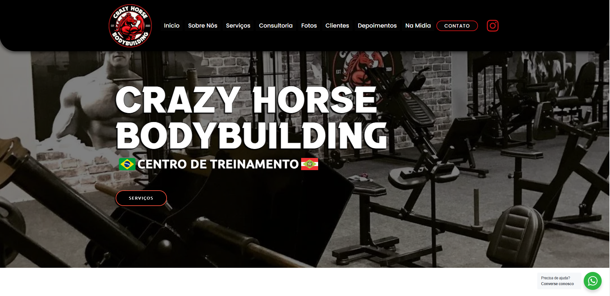

# 🌐 Crazyhorse Bodybuilding Centro de Treinamento

 <!-- Substituir pelo caminho da imagem ou link direto -->

## 📝 Descrição
Site one-page desenvolvido para o **Crazyhorse Bodybuilding Centro de Treinamento**, localizado em São Lourenço do Oeste, SC. Este projeto foi criado para destacar os serviços da academia, horários, informações de contato e atrair novos clientes.  

O foco foi criar uma interface moderna, responsiva e intuitiva, garantindo uma ótima experiência em dispositivos móveis e desktop.

## 🚀 Tecnologias Utilizadas
- **WordPress** com Elementor para customização de design.  
- Plugins:  
  - **Yoast SEO** para otimização de buscas.  
  - **WPForms** para o formulário de contato.  
- HTML/CSS para ajustes específicos e personalizações adicionais.  

## 🎯 Meu Papel no Projeto
- Configuração inicial do WordPress e customização do tema.  
- Criação de uma estrutura de página única (One Page) com as seções:  
  - Apresentação  
  - Serviços  
  - Horários  
  - Contato  
- Integração com Google Analytics para monitoramento de tráfego.  
- Otimização de SEO on-page e carregamento.  

## 📷 Screenshots
- **Seção de Apresentação:**  
    

- **Seção de Serviços:**  
    

- **Seção de Contato:**  
    

## 🌐 Link para o Site
[Crazyhorse Bodybuilding](https://crazyhorse.esp.br/)

## 📊 Impacto do Projeto
- **Aumento de Visibilidade:** Site otimizado para mecanismos de busca, ampliando o alcance da academia.  
- **Feedback Positivo:** Clientes elogiaram a interface moderna e a facilidade de navegação.  

## 📬 Entre em Contato
Caso tenha dúvidas ou queira saber mais sobre o projeto:  
- 📧 E-mail: [philipetoller@gmail.com](mailto:philipetoller@gmail.com)  
- 🌐 [Meu Portfólio](https://lupawebsites.com.br)
